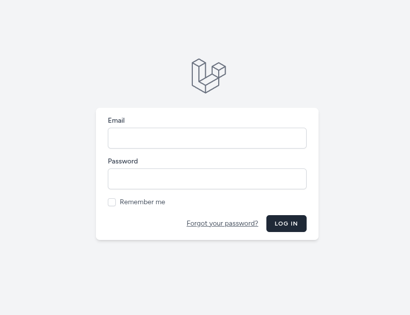

# CRUD Facturas (Laravel 12 + Breeze + Inertia React)

Proyecto de facturación con:
- Laravel 12
- Breeze con Inertia + React
- API REST versionada (`/api/v1`)
- Docker con Laravel Sail

## Requisitos

- Docker Engine
- Git
- Composer
- PHP 8.4+

## Modo nativo / Restaurar desde archivo (sin Docker)

> Nota para este equipo: **Sail NO funciona si el proyecto vive en `/var/www/html`**, porque Docker Desktop (Linux) solo comparte la carpeta `/home`. Para Sail, el proyecto debe estar bajo `/home`. La forma probada y recomendada aquí es **nativa**.

Importante: Laravel 12 requiere **PHP ≥ 8.2**. Si tu `php` por defecto es 8.1, invoca PHP 8.4 explícitamente (incluido al correr Composer).

Pasos para revivir el proyecto archivado desde cero (si se borraron `vendor/` y `node_modules/`):

```bash
# 1. Dependencias PHP (correr Composer con PHP 8.4, NO el 8.1 por defecto)
php8.4 $(which composer) install

# 2. Dependencias y build del frontend (Vite/React)
npm install
npm run build          # genera public/build ; usa 'npm run dev' si vas a editar el front

# 3. Restaurar la base de datos desde el dump incluido
mysql -uroot -p crud_facturas < crud_facturas.sql
#   (si la base no existe: CREATE DATABASE crud_facturas; antes de importar)

# 4. Levantar la app
php8.4 -dxdebug.mode=off artisan serve --port=8085
```

Configuración de `.env` para modo nativo (apunta a tu MySQL local, no a Docker):

```env
APP_PORT=8000
DB_HOST=127.0.0.1
DB_PORT=3306
DB_DATABASE=crud_facturas
DB_USERNAME=root
DB_PASSWORD=<tu_password_mysql_local>
```

Accesos en modo nativo:
- Web: `http://127.0.0.1:8085`
- Login: `http://127.0.0.1:8085/login`  ·  Usuario: `admin@facturas.local` / `admin12345`
- API base: `http://127.0.0.1:8085/api/v1`

---

## Configuración Rápida (Sail)

1. Clonar e ingresar al proyecto:

```bash
git clone https://github.com/dasaam/crud-facturas.git
cd crud-facturas
```

2. Instalar dependencias de PHP:

```bash
composer install
```

3. Copiar entorno:

```bash
cp .env.example .env
```

4. Agrega esta configuración en `.env`:

```env
APP_PORT=9001

VITE_PORT=5175

FORWARD_DB_PORT=3308

DB_CONNECTION=mysql
DB_HOST=mysql
DB_PORT=3306
DB_DATABASE=crud_facturas
DB_USERNAME=sail
DB_PASSWORD=password

WWWUSER=1000
WWWGROUP=1000
```


5. Levantar contenedores:

```bash
./vendor/bin/sail up -d
```

6. Generar key, migrar y sembrar datos:

```bash
./vendor/bin/sail artisan key:generate
./vendor/bin/sail artisan migrate --seed
```

7. Instalar frontend y ejecutar Vite:

```bash
./vendor/bin/sail npm install
./vendor/bin/sail npm run dev
```

## Accesos

- Web: `http://localhost:9001`
- Login: `http://localhost:9001/login`
- API base: `http://localhost:9001/api/v1`



Usuario administrador por defecto:
- Email: `admin@facturas.local`
- Password: `admin12345`

## Comandos Útiles Sail

Arrancar:

```bash
./vendor/bin/sail up -d
```

Detener (sin borrar contenedores):

```bash
./vendor/bin/sail stop
```

Detener y remover contenedores/red:

```bash
./vendor/bin/sail down
```

Reset completo (incluye volumen de MySQL):

```bash
./vendor/bin/sail down -v --remove-orphans
./vendor/bin/sail up -d --build
./vendor/bin/sail artisan migrate:fresh --seed
```

## API (resumen)

Login:
- `POST /api/v1/login`

Con `Bearer token`:
- `POST /api/v1/logout`
- `GET /api/v1/clientes`
- `GET /api/v1/productos`
- `GET /api/v1/facturas`
- `POST /api/v1/facturas`
- `GET /api/v1/facturas/{id}`
- `PUT /api/v1/facturas/{id}`
- `PATCH /api/v1/facturas/{id}/facturar`
- `PATCH /api/v1/facturas/{id}/cancelar`
